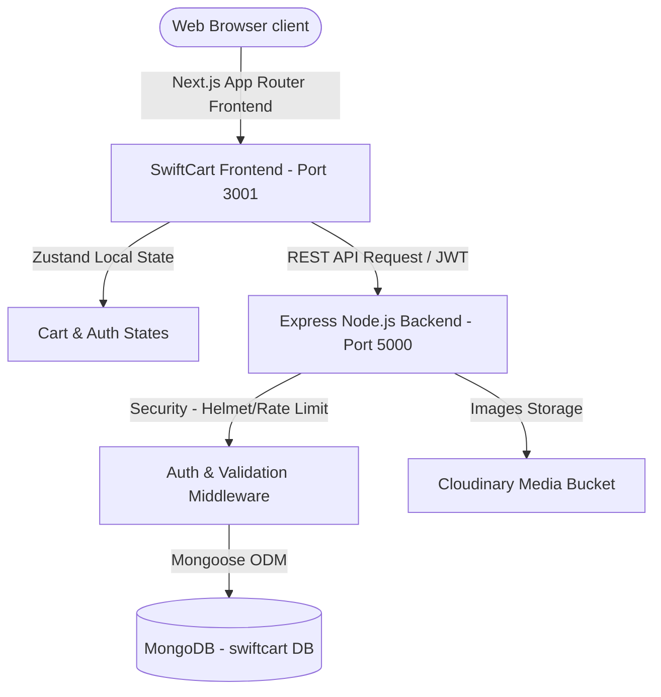

# Business Requirements Document (BRD) & Software Requirements Specification (SRS)
## Project: SwiftCart (Swift-E-commerce)

---

# PART 1: Business Requirements Document (BRD)

## 1. Executive Summary & Objectives
SwiftCart is a premium, high-end e-commerce platform designed to merge classic luxury aesthetics with modern interactive web experiences. Unlike standard e-commerce storefronts that rely on flat grids, SwiftCart aims to capture user attention and improve conversion rates through immersive, hardware-accelerated 3D interactions and a virtual closet dressing room.

The primary business objectives are:
- **Maximize Engagement**: Hook users with tactile 3D Tilt product cards and dynamic parallax categories.
- **Support Interactive Try-On**: Drive clothing category conversion rates by allowing users to try on outfits on a virtual avatar (Closet Builder).
- **Deliver Premium Quality**: Offer a curated earth-tone aesthetic (Beige, Gold, Cream) targeted at design-conscious demographics.

## 2. Target Audience & Stakeholders
- **Consumers (End Users)**: Style-centric shoppers purchasing premium apparel, lighting, decor, and furniture.
- **E-commerce Merchants (Admins)**: Product managers, copywriters, and administrators managing catalogs, order pipelines, coupons, and reviews.
- **Development Team**: Frontend and backend engineers building, updating, and scaling the codebase.

## 3. High-Level Product Scope
- **Interactive Product Catalog**: High-performance grid list featuring dynamic sorting, price slider filters, and category divisions.
- **Immersive Customer Experience**: Interactive 3D tilt product showcases, cursor shine gloss glare, and sliding overlays.
- **Interactive Closet Builder (Dressing Room)**: A React-based closet manager mapping apparel coordinates to avatars.
- **Cart & Checkout Engine**: Coupon codes, discount percentages, addresses, order generation, and state persistence.
- **Admin Command Suite**: Secure portal for updating inventory, managing review averages, checking statistics, and editing coupons.

---

# PART 2: Software Requirements Specification (SRS)

## 1. Introduction
This section details the functional, non-functional, database, and API requirements for the SwiftCart system. 

## 2. System Architecture & Tech Stack

### Tech Stack Details:
- **Frontend Framework**: Next.js 16 (React 19, Turbopack compiler, App Router).
- **Frontend Animation**: Framer Motion 12 (interactive spring physics, motion values).
- **Styling**: Tailwind CSS v4 (inline theme parameters, native CSS variables).
- **State Management**: Zustand 5 (persistent cart drawer storage, auth caching).
- **Backend API**: Node.js, Express.js (v4.19).
- **Database**: MongoDB (Mongoose ODM 8.3).
- **Image hosting**: Cloudinary API.
- **Authentication**: JWT token headers & cookies.

---

## 3. Functional Requirements

### 3.1 User Management, Authentication & Shell Navigation
- **Registration & Login**: Secure account creation with encrypted credentials, phone numbers, and addresses.
- **Auth Guard**: Role-based access control separating regular customers from administrative paths (`/admin`).
- **Unified Profile Shell (`AccountLayout.tsx`)**: Organize account management into distinct routes sharing a sidebar/drawer layout:
  - **Overview** (`/dashboard`): Stats cards (orders, wishlist, cart) and recent order feed.
  - **Profile** (`/profile`): Contact details, name, phone, email, and default address.
  - **Orders** (`/orders`): Track shipments, print invoice documents, and cancel pending orders.
  - **Wishlist** (`/wishlist`): View and manage saved items, or move them directly to the shopping cart.
  - **Addresses** (`/addresses`): Full CRUD operations for managing multiple shipping addresses, including default selections.
  - **Settings** (`/settings`): Deactivate/activate TOTP Two-Factor Authentication (2FA), obtain recovery codes, or update account password.
- **Two-Factor Authentication (MFA)**: Setup TOTP-compliant secrets, generate secure QR Codes, and verify tokens before authorization.
- **Recovery Keys**: Generate 10 dynamic, single-use recovery code alphanumeric strings for emergencies.
- **Passwordless Email OTP**: Secure credentials-free login via time-limited code delivery to customer email.

### 3.2 Product Catalog & Interactive Grid
- **3D Tilt Product Card**:
  - The card rotates dynamically based on mouse coordinate hover tracking (tilt angle limits: $\pm10^\circ$).
  - An absolute-positioned light-flare radial gradient follows the user's cursor.
  - Image scales (`scale-108`) and cross-fades with a secondary product image on hover, while action buttons (Quick View, Add to Cart) slide up.
  - Device compatibility: Disables cursor-tracking on touchscreens (fallback to standard scaling).
- **Advanced Filtering & Search**:
  - Search bar with debounced autocomplete suggestions listing recent searches, popular keywords, and matching products.
  - Active filter tags displayed as chip items with single-click remove buttons and total active count indicators.
  - Dynamic price range sliders (from $0 to $2000).
  - Category radio selection, color/size checkboxes, and list/grid layout toggle views.
- **Quick View Modal**:
  - Popup displaying product specs, average rating, reviews count, low stock warnings, delivery estimate, and return policy.

### 3.3 Virtual Dressing Room (Closet Builder)
- **Virtual Avatar**: Interactive canvas/svg layout displaying an avatar base.
- **Layer Mapping**: Categorized trying on of shirts, pants, dresses, and jackets.
- **Closet Inventory**: Fetches compatible products with coordinate styling tags (e.g. `SvgStyle` and `SvgColor` attributes in product specs).

### 3.4 Cart, Coupons & Checkout
- **Zustand Cart Store**: Persists items in local storage, handles quantity updates, and automatically tallies coupon discounts.
- **Save For Later**: Move items from the cart to a saved storage deck and vice versa.
- **Coupon System**: Code validation checks against active coupon schemas (e.g., `SAVE20` for 20% off, `FREESHIP` for free shipping).
- **Shipping Estimator**: Enter a zip code to calculate delivery fees dynamically.
- **Checkout Process**: Address validation forms leading to final order generation with status options (Pending, Confirmed, Processing, Shipped, Delivered, Cancelled).

### 3.5 Administrative Portal
- **Dashboard**: Track system statistics (total sales, users, order quantities) with complete adaptive Dark Mode theme support.
- **Product Management**: Create, edit, and delete products, uploading pictures directly via Cloudinary.
- **Category Control**: Create featured category headers with custom Unsplash portrait cutouts.
- **User Session Inspection**: Query any customer's live cart contents, active wishlist selections, and complete purchase histories.
- **Enterprise Audit Trails**: Track action histories showing timestamps, admins responsible, and complete before-and-after values object diff.

---

## 4. Database Schema Specifications (Mongoose)

### 4.1 User Schema (`User.js`)
- `name`: String, required.
- `email`: String, required, unique.
- `password`: String, required (stored as bcrypt hash).
- `role`: String ('customer', 'admin'), default 'customer'.
- `phone`: String.
- `addresses`: Array of address subdocuments (street, city, state, zipCode, country, isDefault).
- `twoFactorSecret`: String, base32 secret key for authenticator TOTP check.
- `twoFactorEnabled`: Boolean, active state flag for user MFA.
- `twoFactorRecoveryCodes`: Array of Strings, single-use security recovery keys.
- `otpCode`: String, dynamic time-limited passwordless code sent to email.
- `otpExpiry`: Date, verification expiry time for the dynamic OTP.
- `wishlist`: Array of ObjectIds ref Product, saved items for later review.

### 4.2 Product Schema (`Product.js`)
- `title`: String, required, trimmed.
- `description`: String, required.
- `shortDescription`: String.
- `category`: String, key reference to Category.
- `brand`: String, required.
- `price`: Number, required, minimum 0.
- `salePrice`: Number.
- `discountPercentage`: Number, default 0.
- `stock`: Number, required, minimum 0.
- `rating`: Number, default 0.
- `numReviews`: Number, default 0.
- `thumbnail`: String, required (URL).
- `images`: Array of Strings (URLs).
- `tags`: Array of Strings.
- `specifications`: Map of Strings (e.g., color, material, SVG specs for try-on).
- `featured`: Boolean, default false.

### 4.3 Order Schema (`Order.js`)
- `user`: ObjectId (ref User), required.
- `orderItems`: Array of items (product reference, quantity, price).
- `shippingAddress`: Address subdocument.
- `paymentMethod`: String, default 'Stripe'.
- `taxPrice`: Number, required.
- `shippingPrice`: Number, required.
- `totalPrice`: Number, required.
- `isPaid`: Boolean, default false.
- `paidAt`: Date.
- `isDelivered`: Boolean, default false.
- `deliveredAt`: Date.

---

## 5. Non-Functional Requirements

### 5.1 Performance & Rendering
- **GPU Acceleration**: Interactive card rendering must use native CSS 3D transforms (`transformStyle: preserve-3d`) to offload rendering logic from the main thread.
- **Optimized Images**: Image loading must leverage Next.js `<Image>` component, performing domain whitelisting and auto-compression.
- **Debounced Search Inputs**: Prevent API hammering by delaying searches by `500ms`.

### 5.2 Security & Integrity
- **Password Protection**: Encryption using `bcryptjs` (salt rounds: 10).
- **API Guarding**:
  - Helmet middleware to enforce secure HTTP headers.
  - Express Rate Limiter restricts excessive connection requests.
  - JWT tokens stored securely.

### 5.3 Scalability
- **MongoDB Indexing**: Database indexing on frequently filtered fields (`category`, `price`, `rating`).
- **Responsive Layout**: Fluid breakpoints supporting views from mobile portrait ($320\text{px}$) to widescreen desktops ($1440\text{px}$).
